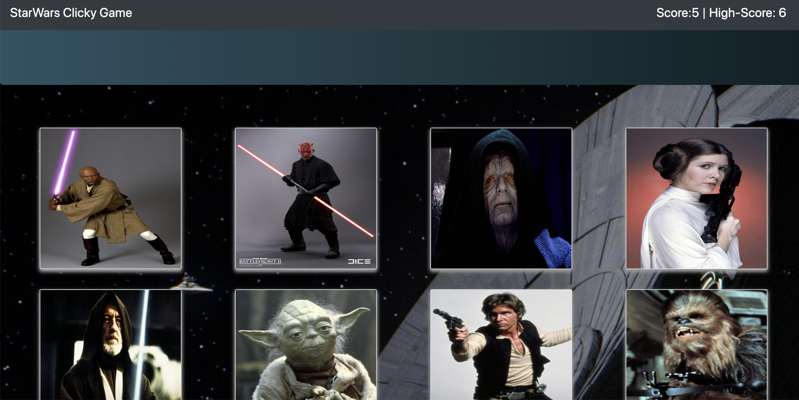

# Clicky Game 

This is the first application that I built using React. Click on any image to start the game! Keep clicking on any star wars character that you have not previously clicked to continue the game! If you click the same image twice, you lose! 

## Getting Started

* Interested in seeing this app deployed? Check it out here!: https://angry-wiles-40c827.netlify.com/
* If you want to deploy and it host it yourself, checkout the deployment section!

### Installing, and deployment

* Clone or download this code to your local machine

* Open locally in your terminal, and in the root file run npm install

* Run locally with npm start

* If you wish to host this site locally, host with Heroku or netlify. 

## Built With

* React, Javascript, CSS,  Express, Node, and MVC design pattern 

## Preview

## Authors

* **Christian Mader** 

